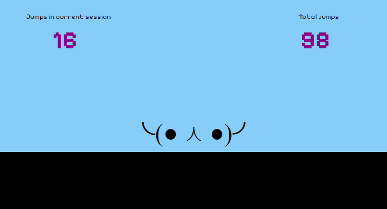

# Web APIs

## Introduction

This project showcases the usage of a couple of native web APIs that can be relevant for developing games in this platform. The application is a **simple game where the player can make a character jump**, and it's developed by using plain HTML5, CSS3 and vanilla JavaScript.

[Web storage API](https://developer.mozilla.org/en-US/docs/Web/API/Web_Storage_API) is used to preserve the player's score in the current browser' session as well as the accumulated score across all sessions so far.

[Fullscreen API](https://developer.mozilla.org/en-US/docs/Web/API/Fullscreen_API) is used

### 🎮 Game controls

The following controls have be defined for this game:

| Action | | Button |
| --- | --- | --- |
| Enter fullscreen mode | ⌨️ | Enter |
| Exit fullscreen mode | ⌨️ | Escape |
| Jump | ⌨️ | Space |

### 🎦 Live preview



## Development journal

TODO

## Additional information

### 🖥️ Project specifications

This application should work in any modern browser (ex.: Google Chrome) that supports the following:

- [CSS Animation](https://caniuse.com/css-animation)
- [Fullscreen API](https://caniuse.com/fullscreen)
- [Web Storage API](https://caniuse.com/namevalue-storage)

### ❔ How to run this project?

To run this application you'll need to run it on a local web server of your choice.

Although any other server would do, the following commands illustrate how to run it by using the [`live-server`](https://www.npmjs.com/package/live-server) package with [Node Package Manager](https://nodejs.org/en) installed in your system.

```bash
# Install local web server to use
$ npm install live-server -g

# Run application in local web server
$ live-server .
```

### 🔗 References

- [Fullscreen API](https://developer.mozilla.org/en-US/docs/Web/API/Fullscreen_API)
- [Web storage API](https://developer.mozilla.org/en-US/docs/Web/API/Web_Storage_API)
- [Animation end event](https://developer.mozilla.org/en-US/docs/Web/API/Element/animationend_event)

### 🎨 Resources

- [EmoticonsText](https://www.emoticonstext.com/)